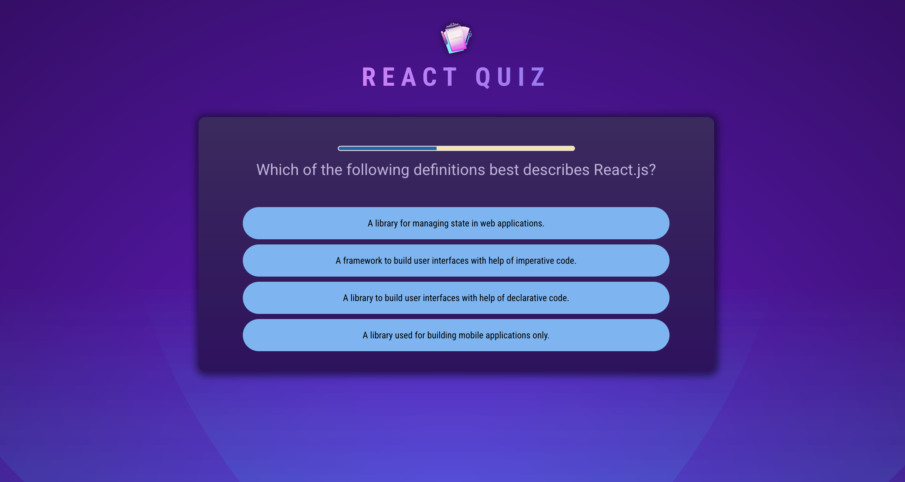
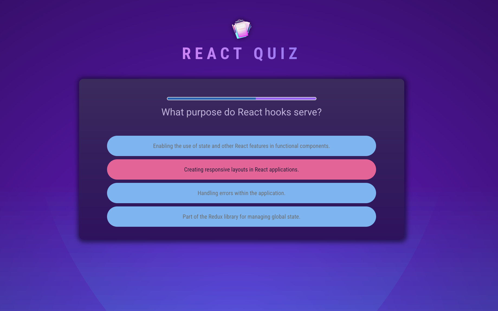
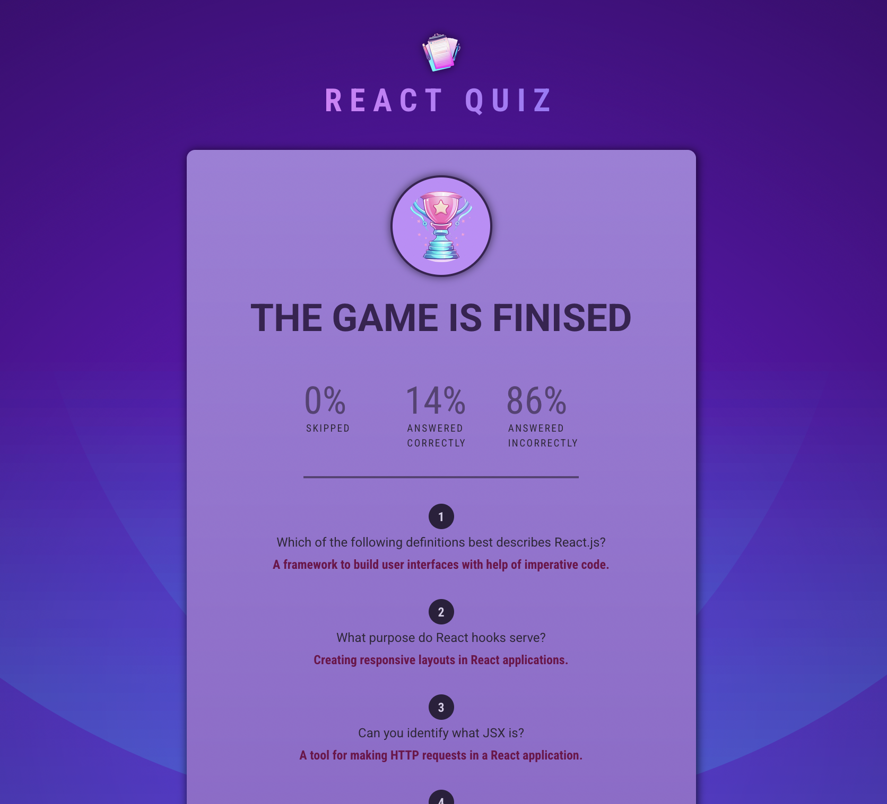

# React Quiz Application

A modern quiz application built with React and Vite, featuring a clean and interactive user interface for taking quizzes.

## Features

- Interactive quiz interface
- Progress tracking
- Multiple choice questions
- Score summary
- Responsive design

## Screenshots

### Main Quiz Interface

*The main quiz interface showing questions and answer options*

### Answer Feedback



### Results Summary

*Final score summary and performance statistics*

> Note: To add screenshots:
> 1. Create a `screenshots` folder in `src/assets/`
> 2. Take screenshots of your application
> 3. Save them with descriptive names (e.g., quiz-interface.png, progress.png, summary.png)
> 4. Update the image paths above to match your actual screenshot files

## Tech Stack

- React 19
- Vite
- Modern JavaScript (ES6+)
- CSS3

## Project Structure

```
src/
├── components/
│   ├── Header.jsx
│   ├── Quiz.jsx
│   ├── Question.jsx
│   ├── Answers.jsx
│   ├── Progress.jsx
│   └── Summary.jsx
├── assets/
├── questions.js
├── App.jsx
├── main.jsx
└── index.css
```

## Getting Started

### Prerequisites

- Node.js (Latest LTS version recommended)
- npm or yarn

### Installation

1. Clone the repository
```bash
git clone [repository-url]
```

2. Install dependencies
```bash
npm install
```

3. Start the development server
```bash
npm run dev
```

4. Build for production
```bash
npm run build
```

## Available Scripts

- `npm run dev` - Start development server
- `npm run build` - Build for production
- `npm run preview` - Preview production build
- `npm run lint` - Run ESLint

## Development

The application is built using modern React practices and follows a component-based architecture. The main components are:

- `Header`: Displays the quiz title and navigation
- `Quiz`: Main quiz container component
- `Question`: Handles individual question display
- `Answers`: Manages answer options and selection
- `Progress`: Shows quiz progress
- `Summary`: Displays final results
